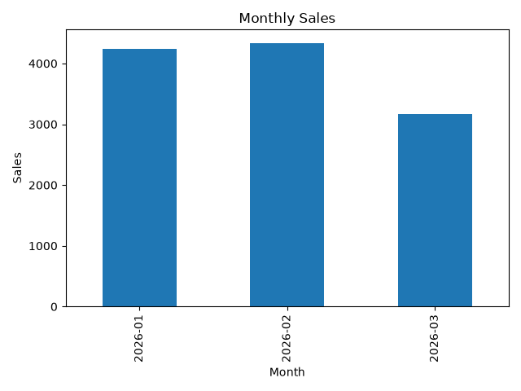

# Sales Analysis with Python

## Project Overview

This project analyzes sales data using Python and pandas to identify key sales trends, top-performing products, regions, and salespeople.

## Business Questions

- What is the total revenue?
- How many units were sold?
- What is the average order value?
- Which product generates the most revenue?
- Which region generates the most revenue?
- Which salesperson generates the most revenue?
- How are sales performing over time?

## Tools Used

- Python
- pandas
- matplotlib
- Git
- GitHub

## Key KPIs

- Total Sales: $11,740
- Total Units Sold: 53
- Average Order Value: $978.33

## Key Insights

- Laptop is the highest revenue-generating product, contributing 64.74% of total sales.
- North is the top-performing region, contributing 31.90% of total sales.
- Carlos is the top-performing salesperson, generating 56.73% of total revenue.
- February recorded the highest monthly sales at $4,340.
- Sales decreased by approximately 27.1% from February to March.

## Project Structure

```text
sales-analysis-python/
│
├── data/
│   └── sales_data.csv
│
├── outputs/
│   └── monthly_sales.png
│
├── src/
│   └── analysis.py
│
└── README.md
```

